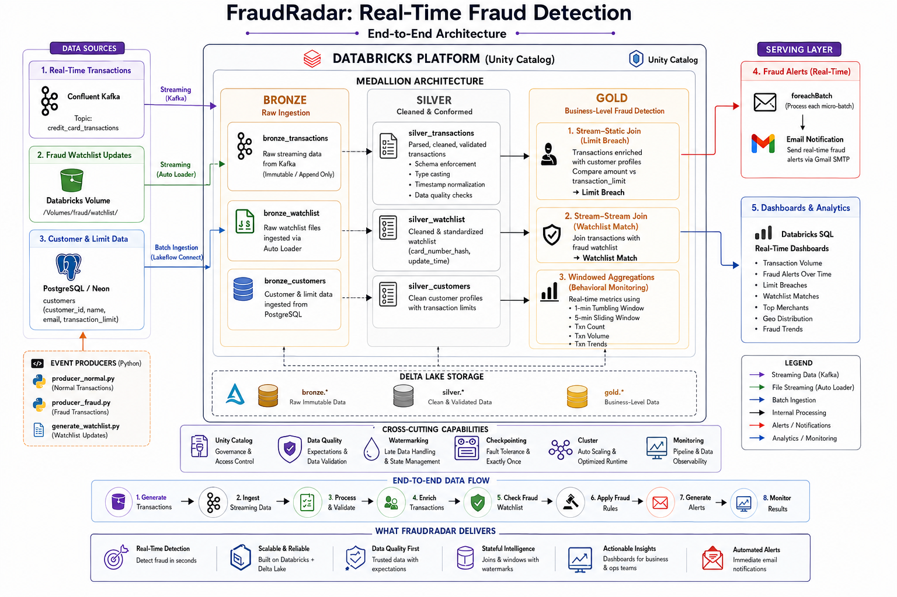
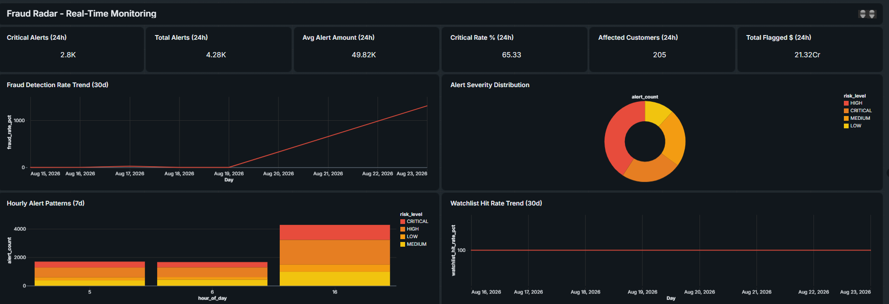

# FraudRadar: Real-Time Fraud Detection with Databricks & Kafka

> An end-to-end real-time fraud detection pipeline built with **Databricks, Apache Kafka, PostgreSQL, Spark Structured Streaming, and Delta Lake**.

FraudRadar is a production-style data engineering project that demonstrates how streaming and batch data can be combined to detect suspicious credit card transactions in near real time.

The project uses **Kafka** for live transaction events, **PostgreSQL** for customer and transaction-limit data, and a continuously updated **fraud watchlist** to identify compromised cards. Data is processed through a **Bronze → Silver → Gold Medallion Architecture** in Databricks, with real-time fraud alerts and dashboards at the serving layer.

---

## 🎯 Business Problem

Traditional fraud detection pipelines often rely on batch processing, which can introduce significant delays between a transaction occurring and suspicious activity being identified.

**FraudRadar** addresses this by continuously processing transactions and checking them against multiple fraud signals:

- 💳 **Transaction Limit Breach** — transaction amount exceeds the customer's configured limit.
- 🚨 **Blocked Card Match** — transaction is associated with a card recently added to the fraud watchlist.
- 📊 **Transaction Volume Monitoring** — real-time tumbling and sliding window aggregations identify unusual transaction activity.

The goal is to demonstrate how a modern streaming architecture can transform raw events into actionable fraud signals with minimal latency.

---

## 🏗️ Architecture



---

## 🧱 Medallion Architecture

### 🥉 Bronze — Raw Ingestion

The Bronze layer captures source data with minimal transformation.

**Sources:**

- **Confluent Kafka** — streaming credit card transactions
- **Databricks Auto Loader** — streaming fraud-watchlist JSON files
- **PostgreSQL / Neon** — customer and transaction-limit data through Lakeflow Connect

The primary goal is reliable ingestion while preserving source information for downstream processing.

---

### 🥈 Silver — Cleaned & Conformed Data

The Silver layer transforms raw data into structured, validated datasets.

Key processing includes:

- Parsing Kafka JSON payloads
- Extracting transaction fields
- Schema enforcement
- Data type casting
- Timestamp normalization
- Data quality validation
- Invalid-record handling using declarative expectations
- Preparing datasets for downstream joins

---

### 🥇 Gold — Business-Level Fraud Detection

The Gold layer contains business-ready fraud signals and streaming metrics.

#### 1. Stream-Static Join

Live Kafka transactions are joined with static customer information from PostgreSQL.

```text
Kafka Transactions
        │
        ├── customer_id ──▶ Customer Profile
        │
        ▼
Compare transaction amount
against customer limit
        │
        ▼
   Limit Breach?
```

This identifies transactions that exceed a customer's configured transaction limit.

#### 2. Stream-Stream Join

The transaction stream is joined with the continuously updated fraud watchlist.

```text
Transaction Stream ─────┐
                        ├──▶ Stream-Stream Join ──▶ Fraud Match
Watchlist Stream ───────┘
```

This demonstrates how Spark manages state when correlating two continuously changing streams.

#### 3. Windowed Aggregations

Time-based aggregations provide visibility into transaction activity.

Examples include:

- 1-minute tumbling windows
- 5-minute sliding windows
- Transaction counts by time period
- Transaction volume monitoring

Watermarks are used to handle late-arriving events while limiting the amount of streaming state retained by Spark.

---

## ⚡ Key Streaming Concepts Demonstrated

| Concept | Implementation |
|---|---|
| Stream ingestion | Kafka + Spark Structured Streaming |
| File streaming | Databricks Auto Loader |
| Batch + streaming integration | Stream-Static Join |
| Streaming correlation | Stream-Stream Join |
| Stateful processing | Windowed aggregations and joins |
| Late data handling | Watermarks |
| Time-based analytics | Tumbling & Sliding Windows |
| Data quality | Lakeflow Declarative Pipeline expectations |
| Micro-batch processing | `foreachBatch` |
| Real-time notifications | Gmail SMTP |
| Data architecture | Bronze / Silver / Gold |
| Governance | Unity Catalog |
| Storage | Delta Lake |

---

## 🛠️ Technology Stack

| Technology | Purpose |
|---|---|
| **Databricks** | Streaming processing, orchestration & analytics |
| **Apache Spark** | Distributed stream processing |
| **Lakeflow Declarative Pipelines** | Declarative pipeline development |
| **Confluent Kafka** | Real-time transaction event streaming |
| **PostgreSQL / Neon** | Customer and transaction-limit data |
| **Databricks Auto Loader** | Incremental fraud-watchlist ingestion |
| **Delta Lake** | Reliable storage for pipeline layers |
| **Unity Catalog** | Data governance and access control |
| **PySpark / Python** | Data transformation and streaming logic |
| **Gmail SMTP** | Real-time fraud notifications |
| **Databricks SQL** | Fraud monitoring dashboards |

---

## 🔄 End-to-End Data Flow

### Step 1 — Generate Transactions

Python producer scripts simulate normal and suspicious credit card transactions.

```text
Python Producer
      │
      ▼
Confluent Kafka
      │
      ▼
Transaction Topic
```

### Step 2 — Ingest Streaming Data

Databricks continuously reads transaction events from Kafka and writes them into the Bronze layer.

### Step 3 — Process & Validate

The Silver layer parses and validates incoming records before making them available for business processing.

### Step 4 — Enrich Transactions

Transactions are enriched with customer information from PostgreSQL.

### Step 5 — Check Fraud Watchlist

Transactions are correlated with the streaming watchlist to identify compromised cards.

### Step 6 — Apply Fraud Rules

FraudRadar evaluates transactions against configured fraud rules.

```text
Transaction
    │
    ├── Amount > Customer Limit?
    │          └── YES → Limit Breach
    │
    └── Card in Watchlist?
               └── YES → Compromised Card
```

### Step 7 — Generate Alerts

Fraudulent records are processed through `foreachBatch` and trigger email notifications.

### Step 8 — Monitor Results

Gold-layer datasets feed Databricks SQL dashboards for real-time monitoring.

---

## 🔐 Security & Configuration

Credentials should **never be hard-coded** into notebooks, scripts, or source-controlled configuration files.

Store sensitive credentials using Databricks Secrets, including:

- Kafka API key
- Kafka API secret
- PostgreSQL credentials
- Gmail App Password

Example:

```python
dbutils.secrets.get(
    scope="fraudradar-scope",
    key="kafka-api-key"
)
```

Use your own secret names and scopes according to your Databricks configuration.

---

## 🚀 Getting Started

### Prerequisites

You will need:

1. A Databricks workspace with Unity Catalog
2. A Confluent Cloud Kafka environment
3. A PostgreSQL database
4. A Gmail account configured with an App Password
5. Python 3.x for the producer scripts

---

### 1. Configure Kafka

Create a Kafka topic:

```text
credit_card_transactions
```

Save the required Kafka connection credentials in Databricks Secrets.

---

### 2. Configure PostgreSQL

Create and populate the customer dimension table.

Example conceptual schema:

```text
customers
├── customer_id
├── customer_name
├── email
└── transaction_limit
```

Load the table into Databricks using Lakeflow Connect or the configured PostgreSQL ingestion process.

---

### 3. Configure the Watchlist

Place fraud-watchlist JSON files in the configured Databricks Volume.

Auto Loader continuously detects newly arriving files.

---

### 4. Start the Producers

Run the transaction simulator:

```bash
python producer_normal.py
```

Run the fraud-event simulator:

```bash
python producer_fraud.py
```

Generate watchlist updates:

```bash
python generate_watchlist.py
```

---

### 5. Start the Databricks Pipelines

Run the required batch ingestion for customer data, then start the streaming pipeline.

The streaming pipeline processes:

```text
Kafka
  ↓
Bronze
  ↓
Silver
  ↓
Gold
  ↓
Fraud Alerts / Dashboards
```

---

## 📊 Monitoring Dashboard

The Gold layer can be exposed through Databricks SQL dashboards to monitor:



These metrics provide both operational visibility and business-level insight into emerging fraud patterns.

---

## 🧠 Engineering Highlights

### Stateless vs. Stateful Processing

The pipeline demonstrates both types of Spark processing.

**Stateless processing:**

- JSON parsing
- Column transformations
- Type casting
- Data cleansing

**Stateful processing:**

- Stream-stream joins
- Window aggregations
- Watermarked processing

---

### Watermarking

Watermarks are used in stateful streaming operations to define how long Spark should retain state for late-arriving events.

This is important for production streaming systems because unlimited state can lead to excessive memory usage.

---

### Data Quality

Declarative pipeline expectations are used to prevent invalid records from propagating into downstream datasets.

Example:

```python
@dp.expect_or_drop(
    "valid_transaction_amount",
    "transaction_amount > 0"
)
```

This keeps the Silver and Gold layers focused on trustworthy data.

---

### `foreachBatch`

`foreachBatch` allows custom logic to execute for each micro-batch.

FraudRadar uses this capability to integrate streaming results with the email notification workflow.

```text
Streaming Data
      │
      ▼
Micro-batch
      │
      ▼
foreachBatch()
      │
      ▼
Fraud Alert
      │
      ▼
Email Notification
```
---

## 📌 Project Outcome

FraudRadar demonstrates an end-to-end architecture for turning continuously arriving financial events into actionable fraud signals:

**FraudRadar showcases how modern streaming data engineering can combine real-time events, batch dimensions, stateful processing, data quality, and business analytics into a single end-to-end platform.**

---
